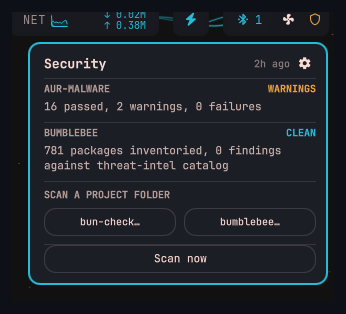
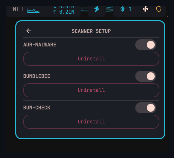

# Security Scan

An [Omarchy](https://omarchy.com) bar-widget plugin that shows a live security badge in your bar. Runs system-wide scans on a 6-hour timer and lets you trigger manual re-scans or per-project one-shot scans from a click-through popup.





## Features

- Live badge: green when clean, amber on warnings, red when compromised
- Popup breakdown per scanner with last-scan timestamp
- Manual "Scan now" button in popup
- Per-project one-shot scan buttons (bun-check, bumblebee)
- **All three scanners are optional** — sections only appear when the tool is installed

## Scanners

| Scanner | What it checks | How to install |
|---|---|---|
| **AUR-Malware** | Atomic Arch IOC scan — pacman/AUR packages, npm/bun caches, eBPF rootkit artifacts, hidden processes | Clone [AUR-Malware](https://github.com/Atomic-Arch/AUR-Malware) to `/local/applications/AUR-Malware/` |
| **[bumblebee](https://github.com/perplexityai/bumblebee)** | Endpoint package inventory across npm, pypi, go, rubygems, homebrew, etc. | `GOBIN=$HOME/.local/bin go install github.com/perplexityai/bumblebee@latest` |
| **bun-check** | Per-project dev-env one-shot scan (opens a terminal picker) | Bundled — run `install.sh` after adding the plugin |

The bun-check one-shot script (`qs-bun-check-oneshot.sh`) is included in this repo. After `omarchy plugin add`, run the optional install step:

```
bash ~/.config/omarchy/plugins/io.github.elynch303.security-scan/install.sh
```

This copies the script to `~/.local/bin/` (prompts to confirm). Pass `--bun-check` or `--no-bun-check` to skip the prompt.

Scanner paths can be overridden with environment variables:

```
QS_SEC_AUR_MALWARE=/path/to/check-atomic-arch_new.sh
QS_SEC_BUMBLEBEE=bumblebee
QS_SEC_BUMBLEBEE_CATALOG=~/.local/share/qs-security/threat-intel
QS_BUN_CHECK=/path/to/bun-checkV2.sh
QS_SEC_STATUS_FILE=~/.cache/qs-security-status.json
```

## How it works

The widget reads `~/.cache/qs-security-status.json`, written by `~/.local/bin/qs-security-scan.sh`. Wire that script into a systemd timer to run every 6 hours:

```ini
# ~/.config/systemd/user/qs-security-scan.timer
[Unit]
Description=Periodic security scan for omarchy bar

[Timer]
OnBootSec=2min
OnUnitActiveSec=6h

[Install]
WantedBy=timers.target
```

```ini
# ~/.config/systemd/user/qs-security-scan.service
[Unit]
Description=Security scan for omarchy bar

[Service]
Type=oneshot
ExecStart=%h/.local/bin/qs-security-scan.sh
```

```
systemctl --user enable --now qs-security-scan.timer
```

## Installation

```
omarchy plugin add https://github.com/elynch303/security-scan.git
```

Then add it to your bar layout in `~/.config/omarchy/shell.json`:

```json
{ "id": "io.github.elynch303.security-scan" }
```

## Requirements

- [Omarchy](https://omarchy.com) with Quickshell
- At least one of the three supported scanners (widget gracefully shows a setup notice if none are installed)

## License

MIT
